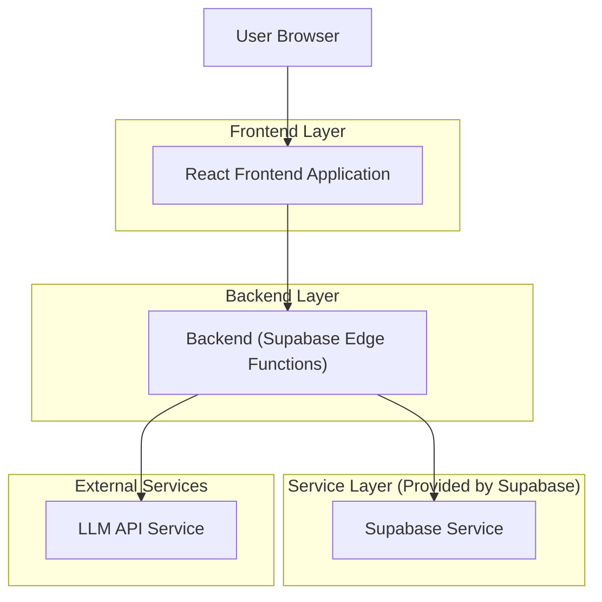
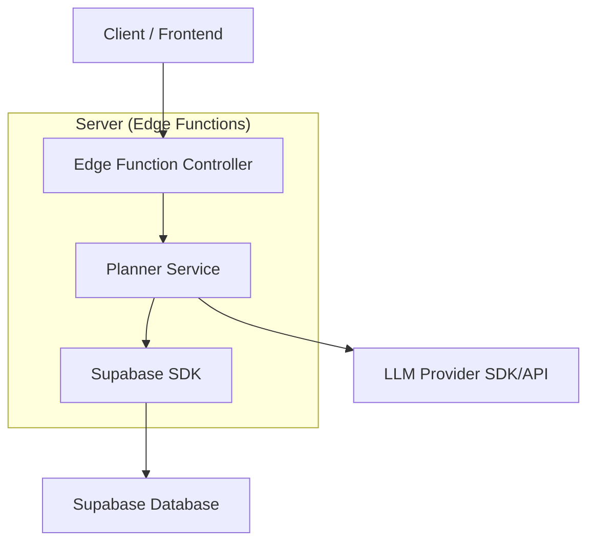
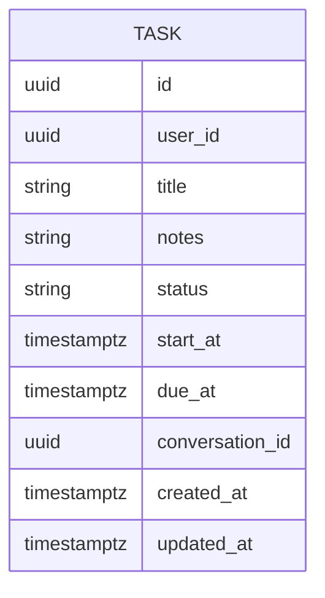

## 1.Architecture design


## 2.Technology Description
- Frontend: React@18 + TypeScript + vite + tailwindcss@3
- Backend: Supabase (Auth + Postgres + Storage opcional) + Supabase Edge Functions (para IA Planner)

## 3.Route definitions
| Route | Purpose |
|-------|---------|
| /lembretes | Hub de tarefas/agenda com modos Lista/Kanban/Agenda/Calendário e IA Planner |
| /conversas/:id | Página de conversa (existente) com tarefas vinculadas |

## 4.API definitions (If it includes backend services)
### 4.1 Core API
Gerar plano via IA Planner
```
POST /functions/v1/planner/generate
```
Request:
| Param Name| Param Type | isRequired | Description |
|---|---:|---:|---|
| input | string | true | Texto em linguagem natural com objetivo, prazos e preferências |
| context | { timezone?: string, weekStart?: string, conversationId?: string } | false | Contexto para melhorar a proposta |

Response:
| Param Name| Param Type | Description |
|---|---|---|
| plan | { tasks: Array<{ title: string, notes?: string, status: string, startAt?: string, dueAt?: string, conversationId?: string }> } | Proposta de tarefas/agenda para revisão |

### 4.2 Shared TypeScript (frontend/backend)
```ts
export type TaskStatus = "todo" | "doing" | "done";

export type Task = {
  id: string;
  userId: string;
  title: string;
  notes?: string;
  status: TaskStatus;
  startAt?: string; // ISO
  dueAt?: string;   // ISO
  conversationId?: string;
  createdAt: string;
  updatedAt: string;
};
```

## 5.Server architecture diagram (If it includes backend services)


## 6.Data model(if applicable)
### 6.1 Data model definition


### 6.2 Data Definition Language
Task Table (tasks)
```
CREATE TABLE tasks (
  id UUID PRIMARY KEY DEFAULT gen_random_uuid(),
  user_id UUID NOT NULL,
  title TEXT NOT NULL,
  notes TEXT,
  status TEXT NOT NULL DEFAULT 'todo',
  start_at TIMESTAMPTZ,
  due_at TIMESTAMPTZ,
  conversation_id UUID,
  created_at TIMESTAMPTZ NOT NULL DEFAULT NOW(),
  updated_at TIMESTAMPTZ NOT NULL DEFAULT NOW()
);

CREATE INDEX idx_tasks_user_id_updated_at ON tasks(user_id, updated_at DESC);
CREATE INDEX idx_tasks_user_id_due_at ON tasks(user_id, due_at);
CREATE INDEX idx_tasks_conversation_id ON tasks(conversation_id);

-- Permissions (baseline; refine with RLS policies conforme necessário)
GRANT SELECT ON tasks TO anon;
GRANT ALL PRIVILEGES ON tasks TO authenticated;
```
