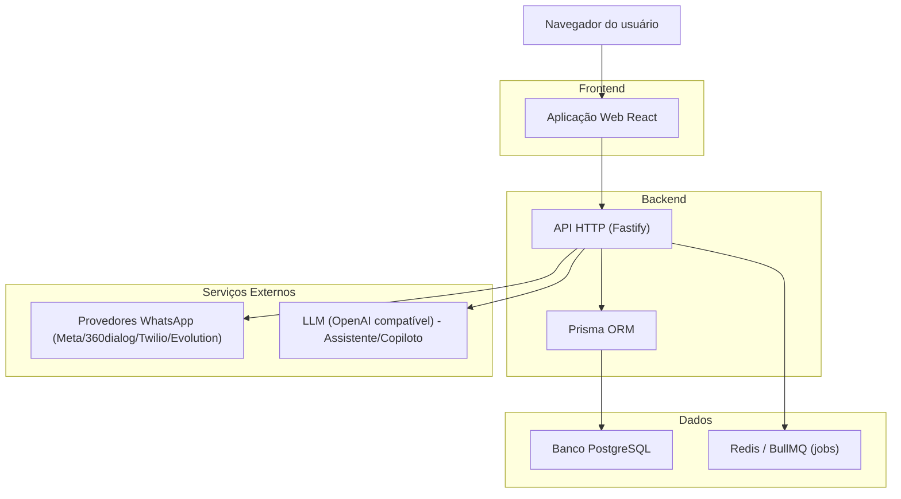
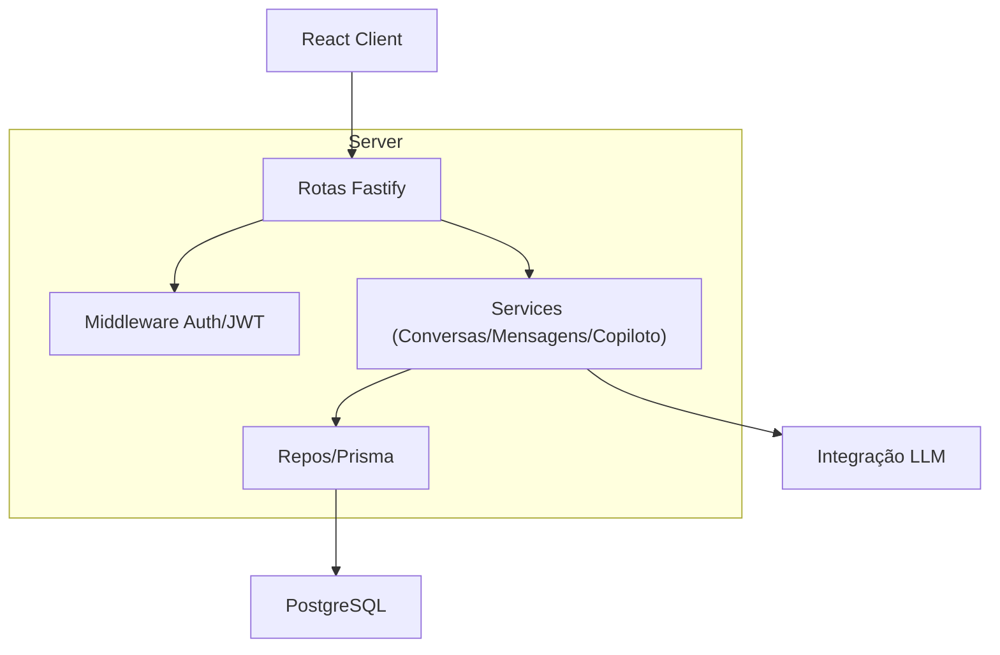
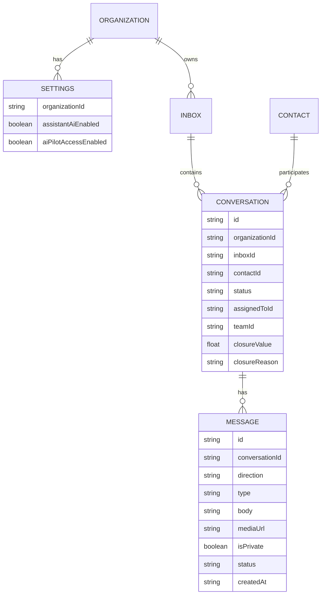

## 1.Architecture design


## 2.Technology Description
- Frontend: React@18 + react-router-dom + tailwindcss + vite
- Backend: Fastify@5 + Zod (validação) + Prisma@6
- Database: PostgreSQL
- Assíncrono/Filas: BullMQ@5 + Redis (ioredis)
- Integrações: WhatsApp providers (dependendo da configuração do tenant) + LLM (via chave configurada no settings)

## 3.Route definitions
| Route | Purpose |
|-------|---------|
| /conversations | Lista de conversas (filtros, busca local, iniciar conversa) |
| /conversations/:id | Tela de detalhe: histórico + composer + ações + CRM + Copiloto (se habilitado) |
| /ai-insights | Página administrativa/operacional para insights e toggles de IA/piloto |

## 4.API definitions (If it includes backend services)
### 4.1 Core API
Conversas
- `GET /conversations?status&teamId&inboxId&mine&pageSize` (listagem)
- `GET /conversations/:id` (detalhe com contato, mensagens, timeline)
- `POST /conversations/:id/read` (marcar como lida)
- `POST /conversations/:id/insights` (Copiloto: resumo/insights/avaliação)

Configurações relacionadas ao Copiloto
- `GET /settings/pilot` (retorna flags mínimas para UI)
- `PUT /settings` (admin: atualizar `assistantAiEnabled` e `aiPilotAccessEnabled`)

TypeScript types (contratos principais)
```ts
type PilotFlags = {
  assistantAiEnabled: boolean;
  aiPilotAccessEnabled: boolean;
};

type CopilotInsights = {
  summary: string;
  intent: string;
  sentiment: "positive" | "neutral" | "negative" | "frustrated";
  suggestedActions: string[];
  conversionOutlook: string;
  alerts: string[];
};

type ConversationListItem = {
  id: string;
  status: "OPEN" | "PENDING" | "RESOLVED";
  updatedAt: string;
  awaitingHumanHandoff?: boolean;
  agentBotTriageActive?: boolean;
  closureValue?: number | null;
  contact: { id: string; name: string; phone: string; profilePictureUrl?: string | null };
  assignedTo: { id: string; name: string } | null;
  team: { id: string; name: string } | null;
  inbox?: { id: string; name: string; isDefault: boolean; channelType?: string } | null;
  leadType: { id: string; name: string; color: string } | null;
  messages: { body: string | null; direction: string; createdAt: string }[];
};
```

Comportamento de “ocultar Copiloto quando desativado” (impacto arquitetural)
- A UI decide exibir Copiloto a partir de `GET /settings/pilot` + papel do usuário (admin ou flag `aiPilotAccessEnabled`).
- Se a API de insights responder com erro de código `ai_disabled`, a UI deve tratar como “IA desativada” e ocultar/fechar o Copiloto.

## 5.Server architecture diagram (If it includes backend services)


## 6.Data model(if applicable)
### 6.1 Data model definition


### 6.2 Data Definition Language
(DDL já existe no schema/migrations do projeto; não é necessária alteração para este redesign, pois o escopo é UI/UX e comportamento de exibição do Copiloto.)