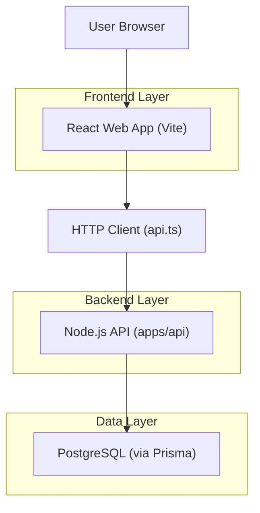
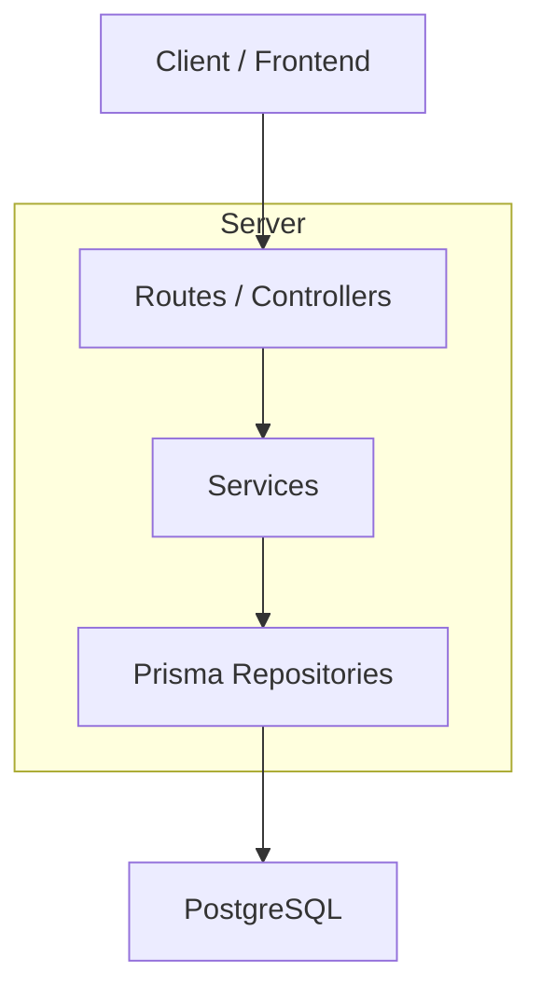

## 1.Architecture design

## 2.Technology Description

* Frontend: React\@19 + react-router-dom\@7 + tailwindcss\@3 + vite\@6

* Backend: Node.js (TypeScript) + Prisma

* Database: PostgreSQL (gerenciada pela stack atual do projeto)

## 3.Route definitions

| Route               | Purpose             |
| ------------------- | ------------------- |
| /login              | Autenticação        |
| /login/reset        | Reset de senha      |
| /                   | Dashboard           |
| /reports            | Relatórios          |
| /ai-insights        | Insights de IA      |
| /conversations      | Lista de conversas  |
| /conversations/:id  | Detalhe da conversa |
| /contacts           | Lista de contatos   |
| /contacts/:id       | Detalhe do contato  |
| /crm                | Kanban CRM          |
| /deals              | Deals               |
| /reminders          | Lembretes           |
| /profile            | Perfil              |
| /settings           | Configurações       |
| /teams              | Times (admin)       |
| /inboxes            | Inboxes             |
| /bots               | Bots (admin)        |
| /automation         | Automação (admin)   |
| /broadcasts         | Broadcasts (admin)  |
| /conversation-audit | Auditoria (admin)   |
| /my-attendance      | Minha atuação       |
| /super              | Console Super Admin |
| /docs               | Docs públicas       |
| /csat/:token        | CSAT público        |

## 4.API definitions (If it includes backend services)

Não há novas APIs para responsividade: o escopo é 100% ajustes de UI/UX no frontend (CSS/layout/componentes), mantendo contratos atuais.

## 5.Server architecture diagram (If it includes backend services)

## 6
