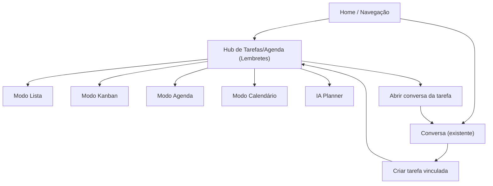

## 1. Product Overview
Transformar a página de **Lembretes** em um **hub único de tarefas/agenda**, com múltiplos modos de visualização e um **IA Planner** integrado.
Você mantém o fluxo atual (rota, criação rápida e uso básico de lembretes), adicionando planejamento e conexão direta com conversas.

## 2. Core Features

### 2.1 Feature Module
O produto (nesta entrega) consiste nas seguintes páginas essenciais:
1. **Hub de Tarefas/Agenda (Lembretes)**: alternância Lista/Kanban/Agenda/Calendário, CRUD de tarefas, IA Planner, vínculo com conversas.
2. **Conversa (existente)**: criação/visualização de tarefas vinculadas à conversa e navegação de retorno ao hub.

### 2.3 Page Details
| Page Name | Module Name | Feature description |
|-----------|-------------|---------------------|
| Hub de Tarefas/Agenda (Lembretes) | Compatibilidade com fluxo atual | Manter mesma rota/entrada do menu; abrir por padrão em **Lista**; preservar “criação rápida” de lembrete/tarefa. |
| Hub de Tarefas/Agenda (Lembretes) | Modelo de Tarefa | Criar/editar tarefa com campos mínimos: título (obrig.), notas (opc.), status (para Kanban), data/hora (para Agenda/Calendário), vínculo opcional a conversa. |
| Hub de Tarefas/Agenda (Lembretes) | Alternância de modos | Alternar entre **Lista**, **Kanban**, **Agenda** e **Calendário** sem perder filtros/seleção; lembrar último modo por usuário. |
| Hub de Tarefas/Agenda (Lembretes) | Lista | Exibir tarefas ordenáveis por data; marcar como concluída; editar inline básico (título/status/data). |
| Hub de Tarefas/Agenda (Lembretes) | Kanban | Exibir colunas por status; mover tarefa por arrastar-e-soltar; abrir edição em painel lateral/modal. |
| Hub de Tarefas/Agenda (Lembretes) | Agenda | Exibir agenda por dia/semana com blocos de tempo; reagendar por arrastar (quando houver hora); abrir detalhes ao clicar. |
| Hub de Tarefas/Agenda (Lembretes) | Calendário | Exibir mês/semana; criar tarefa clicando em um dia/slot; mostrar contagem/itens por dia; navegar para detalhes. |
| Hub de Tarefas/Agenda (Lembretes) | Filtros & busca | Filtrar por status e intervalo de datas; buscar por título/notas; limpar filtros rapidamente. |
| Hub de Tarefas/Agenda (Lembretes) | IA Planner | Capturar objetivo/entrada em linguagem natural; sugerir plano (ex.: semana) e distribuição em agenda; criar/atualizar tarefas propostas com confirmação explícita. |
| Hub de Tarefas/Agenda (Lembretes) | Integração com conversas | Mostrar “Tarefas relacionadas” ao selecionar uma conversa vinculada; navegar para a conversa da tarefa; criar tarefa já vinculada a uma conversa. |
| Conversa (existente) | Ações de tarefa na conversa | Criar tarefa a partir de uma mensagem/trecho; listar tarefas vinculadas (abertas/concluídas); abrir tarefa no hub mantendo contexto de retorno. |

## 3. Core Process
**Fluxo principal (Hub):** você entra em Lembretes (Hub) → vê em Lista (como hoje) → cria rapidamente uma tarefa → alterna para Kanban/Agenda/Calendário conforme necessidade → edita/reagenda/conclui.

**Fluxo IA Planner:** você abre o painel do IA Planner → descreve o que precisa fazer (e prazos) → o sistema sugere um plano (tarefas + horários) → você revisa e confirma → as tarefas aparecem no modo escolhido (Agenda/Calendário/Kanban/Lista).

**Fluxo com conversas:** dentro de uma conversa você seleciona uma mensagem → cria tarefa vinculada → no Hub você filtra/abre a tarefa e consegue voltar à conversa de origem.

