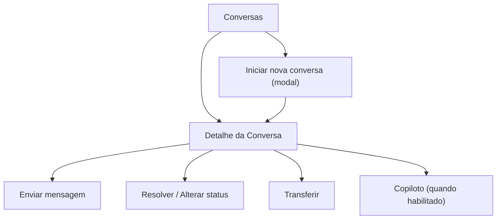

## 1. Product Overview
Redesign completo das páginas de Conversas e Detalhe da Conversa (área de mensagens), mantendo todas as funcionalidades atuais.
Adicionar comportamento consistente para ocultar o Copiloto quando a IA estiver desativada.

## 2. Core Features

### 2.1 User Roles
| Papel | Método de acesso | Permissões principais (no escopo Conversas) |
|------|------------------|--------------------------------------------|
| Agente | Login no workspace/tenant | Ver conversas apenas das caixas (inboxes) em que é membro; listar “Minhas”; enviar mensagens; usar notas privadas; resolver/transferir quando permitido. |
| Admin do tenant | Login no workspace/tenant | Acesso ampliado; pode habilitar/desabilitar IA e liberar acesso ao Copiloto para não-admins; usa todas as funções de conversas. |

### 2.2 Feature Module
Nossos requisitos consistem nas seguintes páginas:
1. **Conversas**: busca na lista, filtros (status, equipe, caixa), alternância “Organização/Minhas”, criação de nova conversa e atalho para enviar mensagem rápida.
2. **Detalhe da Conversa**: histórico de mensagens + composer (texto/emoji/anexo/áudio/nota privada/templates), ações de status (aberta/pendente/resolvida), transferência/atribuição, painel CRM colapsável e painel Copiloto (quando habilitado).

### 2.3 Page Details
| Page Name | Module Name | Feature description |
|-----------|-------------|---------------------|
| Conversas | Cabeçalho e ações | Exibir título/subtítulo; permitir iniciar nova conversa (modal) e acionar mensagem rápida após selecionar contato. |
| Conversas | Busca na lista | Filtrar localmente por nome, telefone (dígitos) e último texto de mensagem. |
| Conversas | Escopo (Organização/Minhas) | Alternar via parâmetro `mine`; refletir visualmente o estado ativo. |
| Conversas | Filtros principais | Filtrar por status (Todas/Aberta/Pendente/Resolvida) e por equipe e caixa (inbox), persistindo em querystring. |
| Conversas | Lista de conversas | Renderizar cards clicáveis com avatar/foto, nome, status, inbox, badges (aguardando handoff humano, atendimento por bot), lead type e valor de fechamento (quando resolvida), e “atualizada há X tempo”. |
| Detalhe da Conversa | Carregamento e leitura | Carregar dados da conversa e marcar como lida; manter navegação por “próxima/anterior” baseada no último conjunto de IDs da lista. |
| Detalhe da Conversa | Histórico de mensagens | Exibir mensagens em ordem; agrupar mensagens próximas (por tempo/direção/nota privada); mostrar estados/indicadores de envio/entrega/leitura; suportar mensagens com mídia (quando presente). |
| Detalhe da Conversa | Composer de mensagem | Enviar mensagem de texto; suportar alternância de “nota privada” vs mensagem normal; respeitar janela de atendimento quando aplicável; suportar expansão do composer quando necessário. |
| Detalhe da Conversa | Anexos e mídia | Anexar arquivo; anexar imagem; indicar estado “enviando anexo”. |
| Detalhe da Conversa | Áudio | Gravar áudio, pré-visualizar e enviar; indicar estados “gravando” e “enviando áudio”. |
| Detalhe da Conversa | Emojis rápidos | Abrir seletor rápido; inserir emoji no composer. |
| Detalhe da Conversa | Templates | Listar e enviar template; abrir modal de envio de template; permitir menu de templates no composer. |
| Detalhe da Conversa | Ações de conversa | Alterar status (Aberta/Pendente/Resolvida); resolver via modal com motivo/lead type/valor (conforme regras do workflow); reabrir quando necessário. |
| Detalhe da Conversa | Transferência e atribuição | Transferir para equipe e/ou agente; refletir responsável atual; carregar lista de equipes/membros quando necessário. |
| Detalhe da Conversa | Painel CRM (direita) | Exibir informações do contato e contexto (ex.: dados, notas, tags, estágio/pipeline quando presente); permitir colapsar/expandir (desktop) e abrir como drawer (mobile). |
| Detalhe da Conversa | Copiloto (IA) – comandos | Quando habilitado, permitir abrir painel e executar: “Resumir”, “Sugerir resposta”, “Avaliar conversa”; exibir carregamento e resultado de insights. |
| Detalhe da Conversa | Copiloto (IA) – ocultar quando desativado | Ocultar completamente o Copiloto quando `assistantAiEnabled=false` (ou quando o usuário não tem acesso): esconder botão/atalho, impedir abertura, e fechar automaticamente se estiver aberto. Em caso de retorno `ai_disabled` ao solicitar insights, desativar e ocultar o Copiloto. |

## 3. Core Process
**Fluxo principal (Agente/Admin)**
1. Você abre **Conversas**, alterna entre “Organização” e “Minhas”, aplica filtros (status/equipe/caixa) e busca.
2. Você clica em um card para abrir o **Detalhe da Conversa**.
3. Você lê o histórico, envia mensagem (texto/emoji/anexo/áudio) e, se necessário, registra nota privada.
4. Você muda o status para Pendente ou Resolve a conversa preenchendo os campos exigidos (conforme regras configuradas).
5. Você transfere a conversa para outra equipe/agente quando necessário.
6. Se o Copiloto estiver habilitado, você abre o painel e solicita resumo/sugestão/avaliação; se a IA estiver desativada, o Copiloto não aparece.

