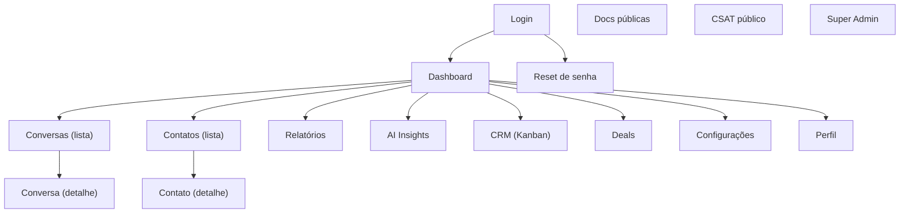

## 1. Product Overview
Ajustar completamente a responsividade do OpenNexo CRM (web), mantendo o design atual e todas as funcionalidades existentes.
O foco é garantir usabilidade em mobile/tablet/desktop com breakpoints claros e regras de áreas mínimas de toque.

## 2. Core Features

### 2.1 User Roles
| Papel | Método de acesso | Permissões centrais |
|------|------------------|---------------------|
| Visitante | Acesso direto | Pode ver Login, Reset de senha, Docs públicas e CSAT público |
| Usuário autenticado (Tenant) | Login | Pode usar módulos do CRM conforme permissões/flags |
| Admin do Tenant | Login (role) | Além do usuário: acessa Times, Bots, Automação, Broadcasts, Auditoria, etc. |
| Super Admin | Login (role) | Acessa Console Super Admin (/super) e pode atuar em tenant |

### 2.2 Feature Module
1. **Autenticação (Login/Reset)**: formulários responsivos, validações e CTA tocável.
2. **Shell do App (Layout + Navegação)**: sidebar/topbar responsivos, navegação acessível em toque, áreas seguras.
3. **Páginas de Operação (listas/detalhes/relatórios)**: tabelas e grids adaptáveis, filtros responsivos, sem overflow horizontal.
4. **Páginas Públicas (Docs/CSAT)**: leitura e formulários ajustados para mobile.
5. **Padrões Globais de Responsividade**: breakpoints oficiais + regras de toque mínimas.

### 2.3 Page Details
| Page Name | Module Name | Feature description |
|-----------|-------------|---------------------|
| Login | Layout responsivo | Ajustar container, espaçamentos e tipografia para evitar rolagem lateral; manter identidade visual. |
| Login | Toque mínimo | Garantir botões/inputs com altura mínima e espaçamento para toque. |
| Reset de senha | Formulário responsivo | Manter fluxo atual com campos/erros legíveis em mobile. |
| Shell do App (Layout) | Breakpoints e navegação | Em mobile: navegação principal acessível (menu recolhível), conteúdo 100% largura; em tablet: layout compacto; em desktop: sidebar fixa como hoje. |
| Shell do App (Layout) | Scroll e alturas | Evitar travas de altura que prejudiquem mobile (teclado virtual); garantir área principal rolável sem cortes. |
| Dashboard | Cards/Grids responsivos | Reflow de cards e métricas: 1 coluna (mobile), 2 (tablet), 3–4 (desktop), preservando visual atual. |
| Conversas (lista) | Lista/tabela adaptável | Evitar tabela “espremida”: em mobile usar linhas empilhadas (cards) ou colunas essenciais; filtros em drawer/accordion. |
| Conversa (detalhe) | Painéis responsivos | Em mobile, empilhar painéis (timeline, detalhes, ações); garantir composer e ações com toque mínimo. |
| Contatos (lista) | Lista adaptável | Mesmas regras de listas: colunas essenciais no mobile e ações acessíveis. |
| Contato (detalhe) | Drawer/painéis | Garantir drawers/modais e abas com scroll correto e sem sobreposição indevida. |
| Relatórios / AI Insights | Visualização responsiva | Gráficos e tabelas com scroll horizontal controlado, tooltips tocáveis e legenda colapsável. |
| CRM (Kanban) / Deals | Kanban responsivo | Em mobile, colunas com scroll horizontal intencional + snap; cards com áreas tocáveis. |
| Lembretes / Inboxes / Times / Bots / Automação / Broadcasts / Auditoria / Minha Atuação / Perfil / Configurações / Super Admin | Padrões de responsividade | Aplicar padrões globais: grids, tabelas, modais, formulários, navegação e toque mínimo; sem alterar regras de negócio. |
| Docs públicas | Leitura responsiva | Conteúdo com largura confortável, tipografia e ancoragem amigável ao toque. |
| CSAT público | Formulário responsivo | Inputs/ratings tocáveis, sem rolagem lateral. |
| Global | Breakpoints oficiais | Definir e usar 3 faixas: Mobile 0–639px, Tablet 640–1023px, Desktop ≥1024px (alinhado a Tailwind). |
| Global | Regras de toque mínimo | Alvo mínimo 44×44px (preferido 48×48px); espaçamento mínimo 8px entre alvos; inputs com min-height 44px; ícones clicáveis com padding. |

## 3. Core Process
Fluxo de Visitante: abrir /login → autenticar → entrar no Dashboard.

Fluxo de Usuário Autenticado: navegar pelo Shell (sidebar/topbar) → acessar módulos (Conversas/Contatos/CRM/Relatórios etc.) → abrir itens de detalhe → executar ações existentes.

Fluxo de Admin/Super Admin: acessar páginas administrativas conforme role (ex.: /teams, /bots, /automation, /super) mantendo mesmas permissões; apenas melhorar experiência em telas pequenas.

