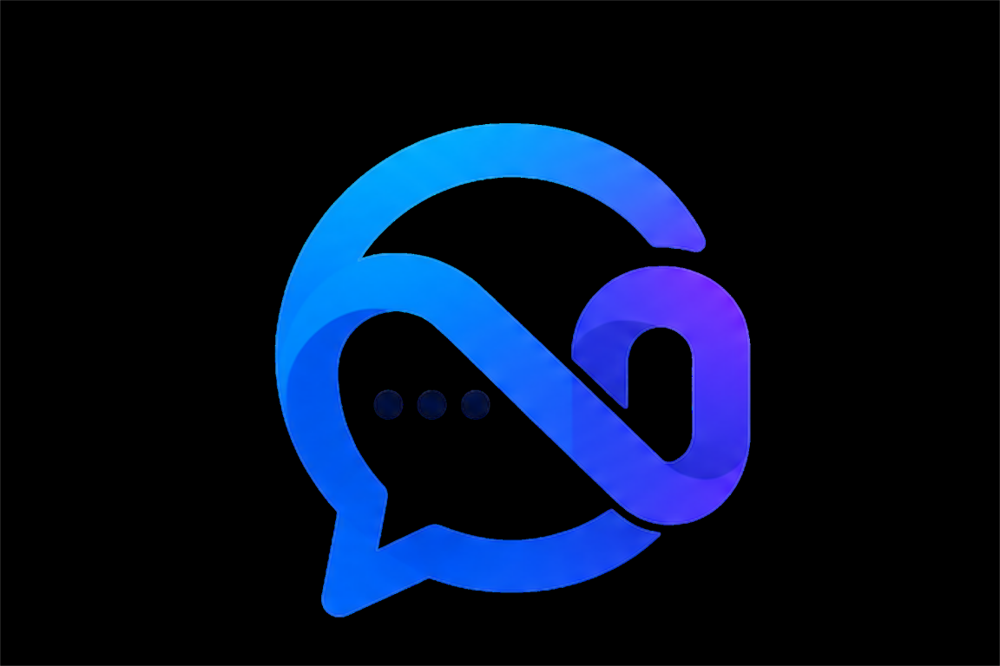

<p align="center">
  
</p>

<h1 align="center">OpenNexo CRM</h1>

<p align="center">
  <strong>The open-source, self-hostable WhatsApp CRM.</strong>
</p>

<p align="center">
  <a href="https://github.com/ojfernandess/Agentslabs-chatCRM/blob/main/LICENSE"></a>
  <a href="https://openconduit.dev"></a>
  
  
  
  
</p>

---

> [!NOTE]
> OpenConduit is under active development and not yet production-ready. APIs, database schemas, and features may change. Star or watch the repo to follow progress.

---

OpenConduit is a WhatsApp CRM you can run on your own server. It connects to the WhatsApp Business API through providers like Meta Cloud API, 360dialog, or Twilio, and gives you a clean interface to manage conversations, contacts, and leads.

Built for freelancers, agencies, and local businesses who already use WhatsApp as their primary channel. No per-seat pricing, no data leaving your infrastructure, no vendor lock-in.

## Features

- **WhatsApp Integration** · Send and receive messages through Meta Cloud API, 360dialog, or Twilio
- **Contact Management** · Organize contacts with tags, notes, and pipeline stages
- **Conversation History** · Full chat interface with delivery receipts and read status
- **Lead Pipeline** · Track contacts from New Lead through to Converted
- **Auto-Tagging** · Automatically tag contacts based on inbound message keywords
- **Follow-up Reminders** · Set reminders with due dates and overdue alerts
- **Quick Reply Templates** · Reusable message snippets accessible while composing
- **Role-Based Access** · Admin and Agent roles with scoped permissions
- **24h Session Window** · Visual indicator and enforcement of WhatsApp's messaging policy
- **Compliance** · Opt-in consent tracking, template-only broadcasts, full data export
- **No Telemetry** · Zero data sent anywhere. Fully self-contained.

## Self-Hosting

### What You Need

- A Linux VPS or any machine that can run Docker (Ubuntu 22.04+ recommended)
- A registered domain name with DNS pointing to your server
- A WhatsApp Business API provider account ([360dialog](https://www.360dialog.com/), [Meta Cloud API](https://developers.facebook.com/docs/whatsapp/cloud-api), or [Twilio](https://www.twilio.com/whatsapp))
- Docker and Docker Compose installed

### Deploy

```bash
git clone https://github.com/ojfernandess/Agentslabs-chatCRM.git
cd Agentslabs-chatCRM
cp .env.example .env
```

Edit `.env` with your configuration:

```env
DATABASE_URL=postgresql://openconduit:your-db-password@db:5432/openconduit
JWT_SECRET=generate-a-random-64-character-string-here
PUBLIC_URL=https://crm.yourdomain.com
```

Start the stack:

```bash
docker compose up -d
```

By default, Caddy is published on host **8080** (→ HTTP port 80 in the container). The bundled **Caddyfile uses HTTP only** (no Let's Encrypt) so a front proxy (e.g. EasyPanel) can terminate TLS; use `PUBLIC_URL` in `.env` for the real public URL (webhooks). Map **8443** only if you add TLS inside Caddy yourself. Open `http://localhost:8080` for local testing. If a panel injects `docker-compose.override.yml` that forces conflicting ports, edit it there.

This brings up the API server, PostgreSQL database, Redis, the web frontend, and Caddy as an HTTP reverse proxy.

**EasyPanel:** domínio, porta do proxy (ex.: **8080** → serviço `caddy`) e `PUBLIC_URL` — ver [EASYPANEL.md](EASYPANEL.md).

### First Login

Open `https://crm.yourdomain.com` in your browser.

| | |
|---|---|
| **Email** | `admin@openconduit.dev` |
| **Password** | `admin123` |

**Change the default password immediately after your first login.**

### Connect WhatsApp

1. Go to **Settings** in the sidebar
2. Select your WhatsApp provider and enter your API credentials
3. Copy the **Webhook URL** shown on the settings page
4. Paste it into your provider's dashboard as the callback URL
5. Click **Test Connection** to verify

Messages will start flowing in as soon as the webhook is registered.

### Environment Variables

| Variable | Description | Required |
|---|---|---|
| `DATABASE_URL` | PostgreSQL connection string | Yes |
| `JWT_SECRET` | Random string for signing auth tokens (64+ chars) | Yes |
| `PUBLIC_URL` | Your public-facing URL (used for webhook registration) | Yes |
| `REDIS_URL` | Redis connection string | No (defaults to `redis://localhost:6379`) |
| `CORS_ORIGIN` | Allowed CORS origin for development | No |
| `PORT` | API server port | No (defaults to `3000`) |

WhatsApp provider credentials are configured through the Settings UI after deployment, not through environment variables.

## Contributing

See [CONTRIBUTING.md](CONTRIBUTING.md) for development setup, coding standards, and how to submit changes.

## Security

If you discover a security vulnerability, **please do not open a public issue.** Use [GitHub's private vulnerability reporting](https://github.com/ojfernandess/Agentslabs-chatCRM/security/advisories/new) instead. See [SECURITY.md](SECURITY.md) for full details.

## License

[MIT](LICENSE)
