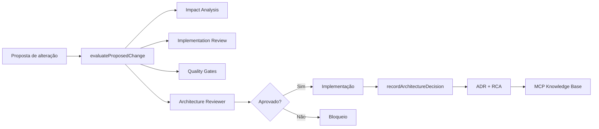

# Architecture Governance System (AGS)

O AGS controla a evolução arquitetural do OpenNexo AI Runtime. Toda alteração estrutural deve gerar um **Architecture Decision Record (ADR)** e, quando aplicável, um registo em **Root Cause Registry (RCA)**.

## Localização

| Artefacto | Caminho |
|-----------|---------|
| Módulo runtime | `apps/api/src/lib/architecture-governance/` |
| ADRs | `docs/architecture/adr/` |
| RCAs | `docs/architecture/rca/` |
| MCP provider | `apps/api/src/lib/mcp/providers/architectureGovernanceProvider.ts` |

## Fluxo



## API programática

```typescript
import {
  evaluateProposedChange,
  recordArchitectureDecision,
  getArchitectureTimeline,
} from "../architecture-governance/governanceService.js";

const pkg = evaluateProposedChange({
  title: "Minha alteração",
  reason: "...",
  problem: "...",
  rootCause: "...",
  modifiedFiles: ["apps/api/src/lib/agent-engine/..."],
  architectureBefore: "...",
  architectureAfter: "...",
  technicalJustification: "...",
});

if (!pkg.architectureReview.approved) {
  // bloquear implementação
}

const { adr, rca } = recordArchitectureDecision({ proposal: { ... } });
```

## MCP — ferramentas

| Tool | Descrição |
|------|-----------|
| `search_adr` | Pesquisa ADRs |
| `search_rca` | Pesquisa RCAs |
| `architecture_impact_analysis` | Impacto por ficheiros alterados |
| `architecture_review` | Review pré-implementação completo |
| `architecture_timeline` | Timeline ADR + RCA |
| `architecture_dependency_graph` | Grafo de componentes runtime |

**Recurso:** `opennexo://architecture/adr/{adrId}`

**Permissão:** `architecture:read` (roles `admin`, `developer`)

## Categorias válidas

Architecture, Performance, Bug, Refactoring, Feature, Security, Memory, Workflow, Planner, Scheduler, Supervisor, Workflow Validator, Prompt Compiler, Capability Graph, Facts Engine, Streaming, Observabilidade, Runtime, Tool Runtime.

A categoria **Outros** não é permitida — o classificador atribui pelo menos uma categoria conhecida.

## Definition of Architectural Done

- ADR criado
- RCA quando há causa raiz
- Impact Analysis executado
- Architecture Review aprovado
- Quality Gates passados
- Architecture Score ≥ 5
- Plano de rollback documentado
- Rastreabilidade via MCP

## Fase 2 (concluída — código)

- Unified Execution Spine (`UnifiedSpineBridge`, modos off/shadow/primary/only)
- `LlmTurnAdapter` — LLM isolado do plan/contract
- Audit MCP: [PHASE-2-SPINE-AUDIT](./baseline/PHASE-2-SPINE-AUDIT-2026-07-30.md)
- `WorkflowRuntimeOrchestrator` — deprecated; não exportado em produção

## Fase 2+ (concluída — Fase 8)

- **Architecture Simulator** — `architecture-governance/simulator.ts` (vet + hotel)
- **CI Gates** — `architecture-governance/ciGate.ts`, `scripts/architecture-ci-gate.mjs`
- **Pre-commit** — `.husky/pre-commit` → `npm run architecture:pre-commit -w apps/api`
- **Patch scan CI** — `scripts/scan-runtime-patches.mjs --fail-on-new`
- **ESLint rule** — `eslint-rules/no-prompt-specific-patches.js`
- **Langfuse** — layer `architecture_governance` em `LangfuseBridge.ts`
- **GitHub Actions** — `.github/workflows/architecture-gates.yml`

### Comandos

```bash
cd apps/api
npm run test:architecture      # regression + scan + simulator
npm run audit:final            # gera FINAL-AUDIT-YYYY-MM-DD.md
npm run architecture:pre-commit # staged runtime files
```

## Fase 9 (concluída)

- **Final Audit** — `architecture-governance/finalAudit.ts` + `run-final-audit.mjs`
- **MCP Protocol** — `mcpAuditProtocol.ts` (pipeline layer verification)
- **Relatório** — `docs/architecture/audit/FINAL-AUDIT-2026-07-31.md`
- **ADR-0003** — status **accepted**

## Roadmap de execução

| Documento | Descrição |
|-----------|-----------|
| [ROADMAP.md](./ROADMAP.md) | Plano completo Fases 0–9 — implementação e correcções |

## Patch Registry & Baseline

| Artefacto | Caminho |
|-----------|---------|
| Patch Registry | `docs/architecture/PATCH-REGISTRY.md` |
| Baseline MCP Audit | `docs/architecture/baseline/BASELINE-AUDIT-2026-07-30.md` |
| Regression manifest | `apps/api/src/lib/agent-engine/regression/baselineManifest.json` |
| Patch scan (CI) | `apps/api/scripts/scan-runtime-patches.mjs` |

## ADRs iniciais

| ID | Título |
|----|--------|
| ADR-0001 | Architecture Governance System (AGS) |
| ADR-0002 | Embratur FNRH reference domains |
| ADR-0003 | Unified Execution Spine — Prompt → IR → Runtime |
| ADR-0004 | Prompt IR Schema v1.0 ✅ |
